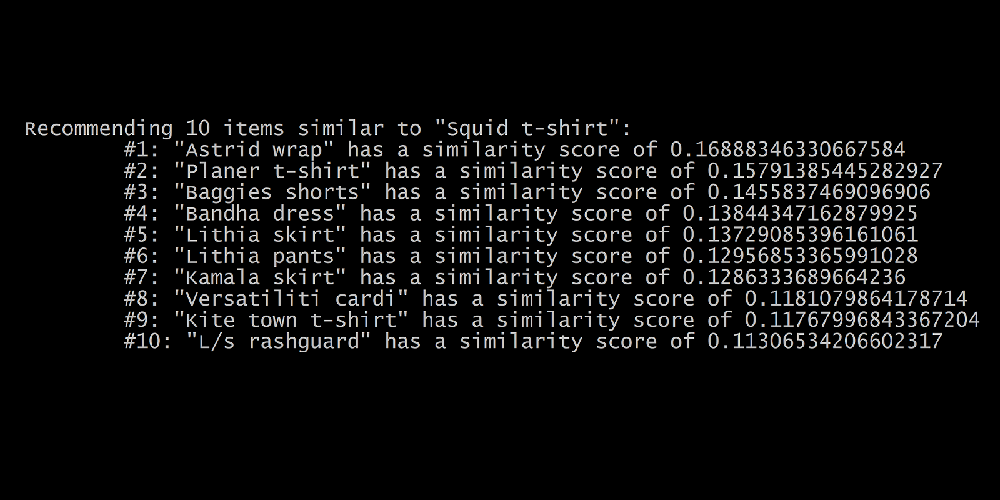

# Recommender System

A recommender system that uses content-based filtering to guess items that a user may prefer based on the features of an item that the user likes.



## Usage

To run the program, use the following commands:

```
pip install -r requirements.txt

python main.py
```
